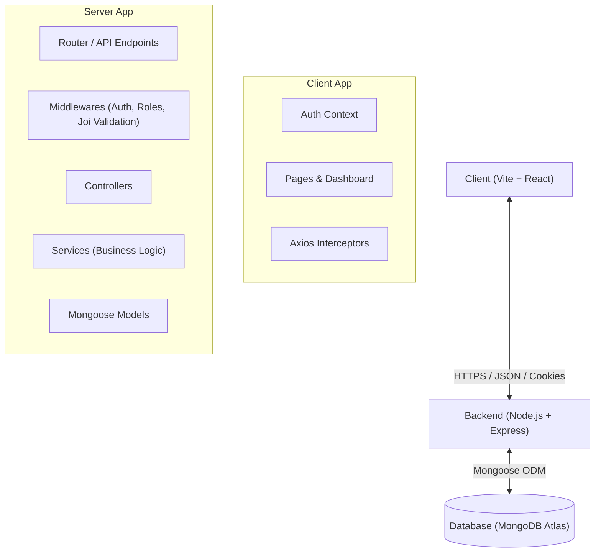
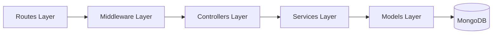
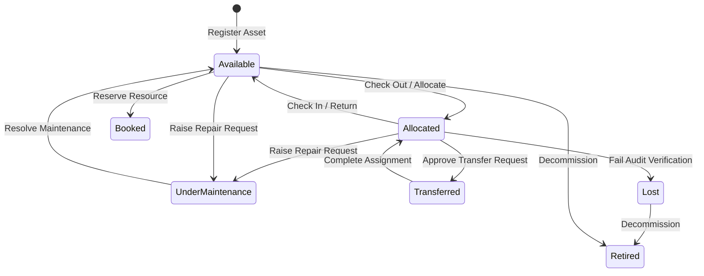
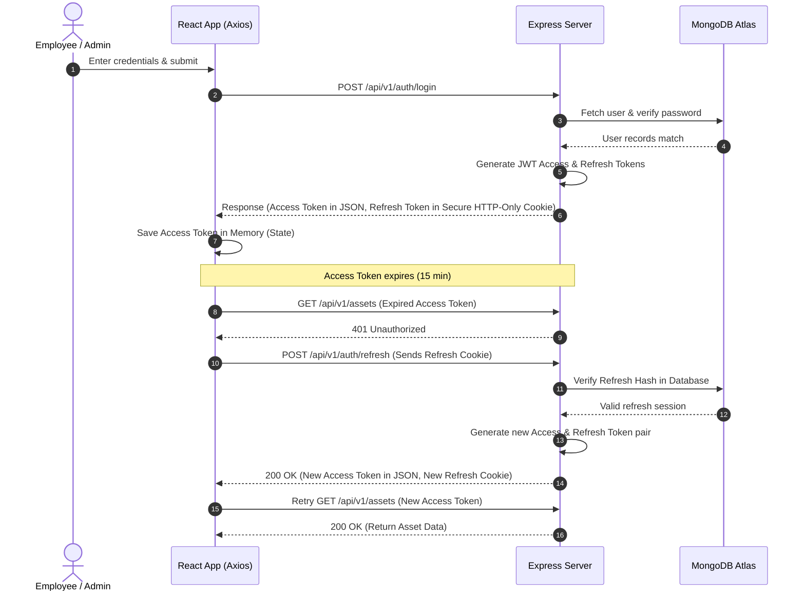

# 🚀 AssetFlow

### Enterprise Asset & Resource Management System

AssetFlow is a modern, cross-industry Enterprise Resource Planning (ERP) platform designed to digitize and manage the end-to-end lifecycle of an organization’s physical assets and shared resources. It replaces outdated spreadsheets with a robust, real-time tracking pipeline for asset registrations, allocations, transfer conflict resolutions, resource bookings, maintenance operations, and physical audits.

---

## 🛠️ Technology Stack

* **Frontend Client:** React 19, Vite, Tailwind CSS, Framer Motion (premium animated transitions).
* **Backend API:** Node.js, Express, Joi (schema validation), JWT Authentication.
* **Database Layer:** MongoDB Atlas (NoSQL) with Mongoose ODM.
* **API Communication:** Axios with automatic token rotation and route protection interceptors.

---

## 📐 Architecture & System Design

### 1. High-Level Design (HLD)

The system uses a classic client-server architecture. The React single-page application (SPA) communicates with the Express REST API via HTTPS, using JSON payloads for data and secure, HTTP-only cookies for session management.



---

### 2. Low-Level Design (LLD)

The backend follows a strict **Three-Layer Architecture** (Routes ➔ Controllers ➔ Services ➔ Models) to cleanly separate business logic from protocol handling and database operations.



* **Routes Layer:** Defines API endpoints and registers path parameters.
* **Middleware Layer:** Handles JWT verification, role-based authorization, and Joi payload validation.
* **Controllers Layer:** Handles HTTP requests and formatting responses using `ApiResponse` and `ApiError` utilities.
* **Services Layer:** Houses all business rules, calculations, resource collision checks, and transactional logic.
* **Models Layer:** Defines strict schemas, pre-save hashing, and indexes.

---

### 3. Data Flow Diagram (DFD)

The diagram below tracks the lifecycle states of an asset as it moves through allocations, check-ins, maintenance pipelines, and audits.



---

### 4. Authentication Flow (JWT Token Rotation)

To balance security and user experience, AssetFlow implements **JWT Token Rotation**. Access tokens are short-lived (15 minutes), while refresh tokens are stored as encrypted hashes in the database and delivered as HTTP-only cookies.



---

## 🚀 Installation & Setup

### Prerequisites
* Node.js (v18+)
* npm (v10+)
* A MongoDB Atlas Cluster

### Step 1: Clone and Install Dependencies

```bash
# 1. Clone the repository
git clone https://github.com/Pranavdotexe/HelloWorld.git
cd HelloWorld

# 2. Install backend dependencies
cd backend
npm install

# 3. Install frontend dependencies
cd ../frontend
npm install
```

### Step 2: Configure Environment Variables
Create a `.env` file in the `backend/` directory:
```ini
NODE_ENV=development
PORT=5000
MONGODB_URI=mongodb+srv://<username>:<password>@cluster0.xxxx.mongodb.net/assetflow?retryWrites=true&w=majority
JWT_ACCESS_SECRET=your_access_secret_key_here
JWT_REFRESH_SECRET=your_refresh_secret_key_here
JWT_ACCESS_EXPIRY=15m
JWT_REFRESH_EXPIRY=7d
CORS_ORIGIN=http://localhost:5173
BCRYPT_SALT_ROUNDS=12
```

### Step 3: Run the Application

#### 1. Start the Backend Server (Terminal 1)
```bash
cd backend
npm run dev
```

#### 2. Start the Frontend Client (Terminal 2)
```bash
cd frontend
npm run dev
```

Open **[http://localhost:5173](http://localhost:5173)** in your browser. 

---

## 🔒 Security Hardening
* **NoSQL Injection Protection:** Queries use structured object attributes instead of raw inputs to prevent query manipulation.
* **Token Rotation:** Old refresh tokens are invalidated upon use. If a reuse attack is detected, all refresh sessions for the compromised user are instantly revoked.
* **HTTP-Only Cookies:** Prevents XSS attacks from accessing the session tokens.
